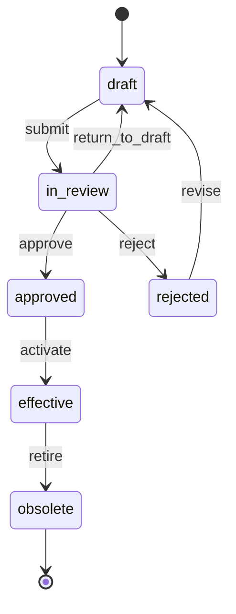

# SPEC-Approval.md

## Purpose

Define review and approval workflows.

## Scope

The approval workflow covers:

- Object lifecycle state machine
- Review and approval actions
- Rejection with comments
- Electronic signature support
- AI-generated draft review workflow
- Immutable approved versions

## Stakeholders

- Regulatory Authors — submit objects for review
- QM Reviewers — review and approve/reject
- Regulatory Approvers — final sign-off
- System Administrators — configure workflow rules
- Auditors — review approval history

## Requirements

### WF-APP-0001
Objects shall follow lifecycle states: draft, in_review, approved, effective, obsolete.

### WF-APP-0002
Approval shall require identified approver, timestamp and approval decision.

### WF-APP-0003
Rejected objects shall retain reviewer comments.

### WF-APP-0004
Approved versions shall be immutable.

### WF-APP-0005
Electronic signatures shall be supported for regulated workflows.

### WF-APP-0006
AI-generated drafts shall require human review before approval.

## Domain Model

### Lifecycle States

## Interfaces

- REST API — workflow action endpoints
- Domain Services — state transition logic
- Event Store — workflow event logging
- UI — workflow action buttons and approval dialogs

## Data Model

### Approval Record

| Field | Type | Description |
|---|---|---|
| approval_uuid | UUID | Stable identifier |
| object_uuid | UUID | Approved object |
| version_no | INT | Object version approved |
| action | VARCHAR | approve / reject / return_to_draft |
| approver_user_id | VARCHAR | Person who performed action |
| comments | TEXT | Decision rationale |
| signature_hash | VARCHAR | Electronic signature hash |
| created_at | DATETIME | Approval timestamp |

## Workflow

- Submit: draft → in_review (requires author role)
- Approve: in_review → approved (requires approver role, separate from author)
- Reject: in_review → rejected (includes mandatory comments)
- Return: in_review → draft (with revision guidance)
- Activate: approved → effective (scheduled or manual)
- Revise: rejected → draft (author revises and resubmits)

## Security

- Approval requires role distinct from authoring role (SEC-RBAC-0004)
- All workflow events are auditable (SEC-RBAC-0005)
- Electronic signatures are cryptographically verifiable
- Approved versions are immutable

## AI Support

- AI may generate review checklists based on object type
- AI may flag missing required fields before submission
- AI shall not approve or reject objects (AI-CORE-0001)

## Acceptance Criteria

- An object can transition through the full lifecycle.
- An approved object version is immutable.
- A rejected object retains reviewer comments.
- Electronic signature is stored with approval record.
- AI-generated drafts require human approval before becoming effective.

## Open Questions

- Should parallel review (multiple reviewers) be supported?
- Should there be deadline-based escalation?
- How to handle emergency approvals outside normal workflow?
